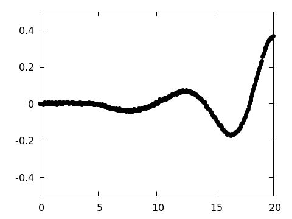
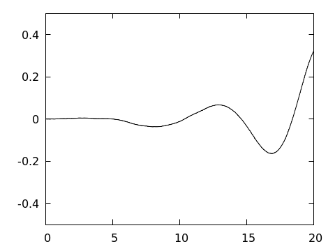

# Vvflow CFD suite

[vvd-wiki]: https://en.wikipedia.org/wiki/Viscous_vortex_domains_method
[pbs-wiki]: https://en.wikipedia.org/wiki/Portable_Batch_System
[issue]: https://github.com/vvflow/vvflow/issues/new
[lua]: https://learnxinyminutes.com/docs/lua/
[awk]: https://man7.org/linux/man-pages/man1/awk.1p.html
[ffmpeg]: https://ffmpeg.org/about.html
[packagecloud]: https://packagecloud.io/vvflow/stable

An implementation of the [Viscous Vortex Domains][vvd-wiki] (VVD) method.

> The VVD method is a mesh-free method of computational fluid dynamics
> for directly numerically solving 2D Navier-Stokes equations in Lagrange
> coordinates. It doesn't implement any turbulence model and free of
> arbitrary parameters.

<p align="center">
    
</p>

## Table of contents

* [Installation](#installation)
* [Flow simulation](#flow-simulation)
* [Results postprocessing](#results-postprocessing)
    * [vvxtract](#vvxtract)
    * [vvplot, vvencode](#vvplot-vvencode)
    * [gpquick](#gpquick)
    * [vvawk](#vvawk)
* [Building from source](#building-from-source)

## Installation

```
curl -s https://packagecloud.io/install/repositories/vvflow/stable/script.deb.sh -o vvflow.deb.sh
sudo bash ./vvflow.deb.sh
sudo apt install vvflow
```

Binary packages are hosted at [packagecloud.io][packagecloud]. For
today, those are available for ubuntu 22.04 (jammy) and 24.04 (noble).

You can also try installing it on other dists, more modern dists are
usually compatible. To do so specify the version manually:

```
sudo os=ubuntu dist=noble bash ./vvflow.deb.sh
sudo apt install vvflow
```

> ⚠️ For performance reasons it's recommended to build vvflow
> [from source](#building-from-source).

Don't hesitate to [open an issue][issue] if you encounter any problems.

## Flow simulation

Both defining the CFD problem and running the simulation is performed by
the command `vvflow`. It's a [Lua][lua] interpreter, so it supports
everything that Lua supports (and even more).

For a start, one can copy the example simulation from doc:

```bash
cp -R /usr/share/doc/vvflow/example/ ./vvflow-demo
cd ./vvflow-demo
chmod +x ./cyl_re600.lua
./cyl_re600.lua
export OMP_NUM_THREADS=1 # disable multi-threading for now
vvflow --progress ./cyl_re600.h5
```

This will compose the CFD problem as described in `cyl_re600.lua`
and run the simulation (for a minute or two).

The `vvflow` can be run on a [PBS][pbs-wiki] cluster:

```bash
#!/bin/bash
qsub -d. -l nodes=1:ppn=6 -N testrun <<'EOF'
    export OMP_NUM_THREADS=$PBS_NUM_PPN;
    exec vvflow cyl_re600.h5;
EOF
```

## Results postprocessing

The results are saved to the current working directory during the simulation:

* `stepdata_cyl_re600.h5` - time series of integral parameters (forces, bodies dispositions, etc.)
* `results_cyl_re600/*.h5` - snapshots of the simulation space over time

Those are raw data, which can be processed using the following tools:

* [vvxtract](#vvxtract)
* [vvplot, vvencode](#vvplot-vvencode)
* [gpquick](#gpquick)
* [vvawk](#vvawk)

### vvxtract

The `vvxtract` tool is primarily used to process `stepdata` files:

```console
$ vvxtract stepdata_cyl_re600.h5 --list
body00/delta_position
body00/force_friction
body00/force_holder
body00/force_hydro
body00/holder_position
body00/speed_slae
time

$ vvxtract stepdata_cyl_re600.h5 time body00/force_hydro | head -n5
#time   body00/force_hydro[1]   body00/force_hydro[2]   body00/force_hydro[3]
+0.000000e+00   +3.140723e+01   -2.354987e-14   -1.770759e-15
+5.000000e-02   +4.766549e-01   +2.608255e-06   +7.130145e-15
+1.000000e-01   +8.190494e-01   -1.868534e-03   -5.548347e-05
+1.500000e-01   +7.309763e-01   -1.069637e-04   +5.027510e-05
```

The `vvxtract` tool can also process `results` files. In this case it
acts as the opposite of the `vvflow` and outputs the simulation space
info in a Lua-like format.

### vvplot, vvencode


To visuzalize the simulation space use the `vvplot` tool.
It requires `gnuplot` program, so ensure it is installed first:

```bash
sudo apt install gnuplot
vvplot results_cyl_re600/000150.h5 ./ -BV -x -1,4 --size 480x360
```

Draw an animation:

```bash
mkdir -p images_cyl_re600
for f in $(ls results_cyl_re600/*.h5); do
    vvplot $f images_cyl_re600 -BV -x -2,20
    echo $f
done
```

A single movie can be encoded with the `vvencode` tool.
Install [FFmpeg][ffmpeg] first if you don't have it yet.

```bash
sudo apt install ffmpeg
vvencode 'images_cyl_re600/*.png' cyl_re600.mp4
```

### gpquick



The `gpquick` tool is useful for previewing `stepdata` files:

```bash
vvxtract stepdata_cyl_re600.h5 time body00/force_holder \
| gpquick --points -u 1:3 -y -0.5 0.5 --size 480 360 -o fy_raw.png;
open fy_raw.png
```

### vvawk

This is a bunch of helpful [awk] scripts, like command-line MS-Excel.
It is supposed to be used in combination with `vvxtract`.

 - `vvawk.avg`: the arithmetic mean in a column.
 - `vvawk.sd`: the standard deviation in a column.
 - `vvawk.zeros`: find zeroes.
 - `vvawk.mavg`: the moving average in a column.
 - `vvawk.drv`: the derivative.
 - `vvawk.ampl`: the amplitude in a column - `avg(max) - avg(min)`.



Example of moving average:

```bash
vvxtract stepdata_cyl_re600.h5 time body00/force_holder \
| vvawk.mavg -v col=3 - \
| gpquick --lines -u 1:3 -y -0.5 0.5 --size 480 360 -o fy_mavg.png;
open fy_mavg.png
```

## Building from source

Install build and runtime dependencies:

```bash
sudo apt-get update
sudo apt-get install build-essential cmake make git liblapack-dev gnuplot
```

Build the project:

```bash
git clone https://github.com/vvflow/vvflow.git
cd vvflow
cmake -Bbuild -S. \
    -DCMAKE_BUILD_TYPE=RelWithDebInfo \
    -DCMAKE_INSTALL_PREFIX=$HOME/.local/vvflow \
    -DCMAKE_INSTALL_RPATH=$HOME/.local/vvflow/lib
make -C build
make -C build install
```

Update the PATH shell environment accordingly:

```bash
echo 'export PATH="$HOME/.local/vvflow:$PATH"' >> ~/.bashrc
source ~/.bashrc
```
