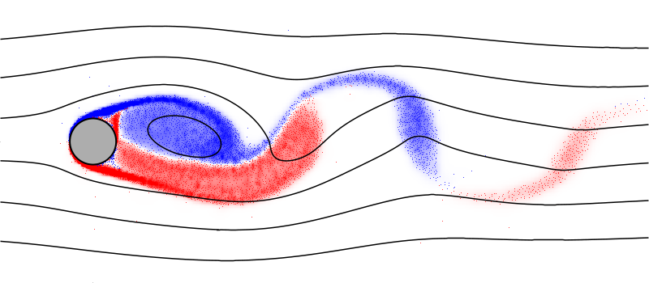
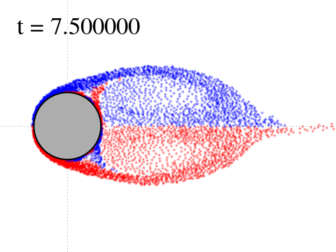
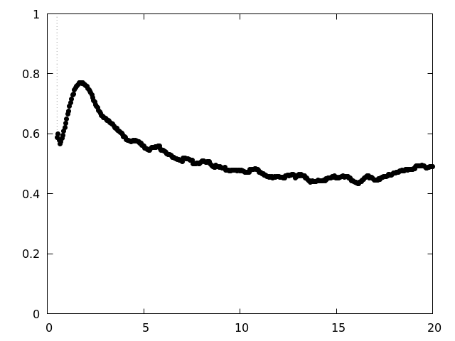

# Vvflow CFD suite

[vvd-wiki]: https://en.wikipedia.org/wiki/Viscous_vortex_domains_method
[pbs-wiki]: https://en.wikipedia.org/wiki/Portable_Batch_System
[issue]: https://github.com/vvflow/vvflow/issues/new
[lua]: https://learnxinyminutes.com/docs/lua/
[awk]: https://man7.org/linux/man-pages/man1/awk.1p.html
[ffmpeg]: https://ffmpeg.org/about.html

An implementation of the [Viscous Vortex Domains][vvd-wiki] (VVD) method.

> The VVD method is a mesh-free method of computational fluid dynamics
> for directly numerically solving 2D Navier-Stokes equations in Lagrange
> coordinates. It doesn't implement any turbulence model and free of
> arbitrary parameters.

<p align="center">
    
</p>

## Table of contents

* [Installation](#installation)
* [Flow simulation](#flow-simulation)
    * [vvcompose](#vvcompose)
    * [vvflow](#vvflow)
* [Postprocessing results](#postprocessing-results)
    * [vvxtract](#vvxtract)
    * [vvplot, vvencode](#vvplot-vvencode)
    * [vvawk](#vvawk)
    * [gpquick](#gpquick)
* [Building from source](#building-from-source)

## Installation

```
curl -s https://packagecloud.io/install/repositories/vvflow/stable/script.deb.sh | sudo bash
sudo apt install vvflow
```

For today, binary packages are available for ubuntu 18.04 (bionic),
20.04 (focal), 20.10 (groovy). On other Linux platforms, it can be
[built from source](#building-from-source).

Don't hesitate to [open an issue][issue] if you encounter any problems.

## Flow simulation

For a start, one can copy the example simulation from doc:

```bash
cp -R /usr/share/doc/vvflow/example/ ./
cd example
make
```

This will compose the CFD problem as described in `cylinder.lua` file,
run the simulation (for a minute or two), and plot the results.

### vvcompose

Defining the CFD problem is handled by the `vvcompose` tool. It's a
[Lua][lua] interpreter, so it supports everything that Lua supports
(and even more).

Flow around circular cylinder:

```bash
#!/bin/bash
vvcompose <<SCRIPT
    S.inf_vx = "1"
    S.re = 600
    S.dt = 0.005
    S.dt_save = 0.1
    S.finish = 500

    cyl = gen_cylinder{R=0.5, N=350}
    cyl.label = "cyl"
    S.body_list:insert(cyl)

    S.caption = "re600_n350"
    S:save(S.caption..".h5")
SCRIPT
```

### vvflow

The flow simulation itself is performed by `vvflow` tool:

```
vvflow --progress --profile re600_n350.h5
```

The `vvflow` can be run on a [PBS][pbs-wiki] cluster:

```bash
#!/bin/bash
qsub -d. -l nodes=1:ppn=6 -N testrun <<'EOF'
    export OMP_NUM_THREADS=$PBS_NUM_PPN;
    exec vvflow re600_n350.h5;
EOF
```

## Postprocessing results

The results are saved to the current working directory during the simulation:
* `stepdata_re600_n350.h5` - integral parameters (forces, dispositions) time series.
* `results_re600_n350/*.h5` - vortex distributions over time.

Those are raw data, which can be processed using one of the following:
* [vvxtract](#vvxtract)
* [vvplot, vvencode](#vvplot-vvencode)
* [vvawk](#vvawk)
* [gpquick](#gpquick)

### vvxtract

The `vvxtract` tool is the opposite of the `vvcompose`.
It prints `.h5` file content in a human-readable form.

```console
$ vvxtract re600_n350.h5
-- space
S.re = 600
S.inf_vx = '1'
S.time = '0/1' -- 0
S.dt = '5/1000' -- 0.005
S.dt_save = '1/10'
S.finish = 500
-- #S.body_list = 1 -- number of bodies
-- #S.vort_list = 0 -- number of vortex domains
-- #S.sink_list = 0 -- number of sinks and sources

-- body00 (cyl)
cyl.label = 'cyl'
cyl.slip = false -- no-slip
-- #cyl = 350 -- number of segments
-- cyl.get_axis() = {0, 0} -- rotation axis
-- cyl.get_cofm() = {0, 0} -- center of mass
-- cyl.get_slen() = 3.14155 -- surface length
-- cyl.get_area() = 0.785356
-- cyl.get_moi_cofm() = 0.0981642
-- cyl.get_moi_axis() = 0.0981642
```

Stepdata files can be handled the same way:

```console
$ vvxtract stepdata_re600_n350.h5 time body00/force_hydro | less
#time   body00/force_hydro[1]   body00/force_hydro[2]   body00/force_hydro[3]
+0.000000e+00   +3.140723e+02   -2.296381e-13   +5.088693e-15
+5.000000e-03   +2.557315e+00   +1.390750e-04   -1.982764e-14
+1.000000e-02   -1.157489e+00   +4.054699e-04   +1.064268e-04
+1.500000e-02   +8.585840e-01   -1.463448e-01   -6.041857e-02
...
```

### vvplot, vvencode



To plot the images use `vvplot` tool:

```bash
vvplot re600_n350.h5 ./ -B -x -1,4
vvplot results_re600_n350/000150.h5 ./ -B --V 10 -x -1,4
```

Draw an animation:

```bash
mkdir -p images
ls results_re600_n350/*.h5 | xargs -I{} vvplot {} ./images -BV -x -2,20
```

A single movie can be encoded with the `vvencode` tool - a small
wrapper script for the [FFmpeg][ffmpeg]:

```bash
vvencode 'images/*.png' re600_n350.mp4
```

### vvawk

This is a bunch of helpful `awk` scripts, like command-line MS-Excel.
It can be very useful in combination with `vvxtract`.

 - `vvawk.avg`: the arithmetic mean in a column.
 - `vvawk.sd`: the standard deviation in a column.
 - `vvawk.zeros`: find zeroes.
 - `vvawk.mavg`: the moving average in a column.
 - `vvawk.drv`: the derivative.
 - `vvawk.ampl`: the amplitude in a column - `avg(max) - avg(min)`.

### gpquick


The `gpquick` tool is used to preview plots.

```bash
vvxtract stepdata_re600_n350.h5 time body00/force_hydro \
| gpquick --points -y 0 1 \
| display

```



In combination with `vvawk.mavg` (moving average):

```bash
vvxtract stepdata_re600_n350.h5 time body00/force_hydro \
| vvawk.mavg -v span=10 - \
| gpquick --points -y 0 1 \
| display
```

## Building from source

Install build dependencies:

```bash
sudo apt-get update
sudo apt-get install build-essential cmake make git liblapack-dev
```

Build the project:

```bash
git clone https://github.com/vvflow/vvflow.git
cd vvflow
cmake .
make -j
sudo make install
```
